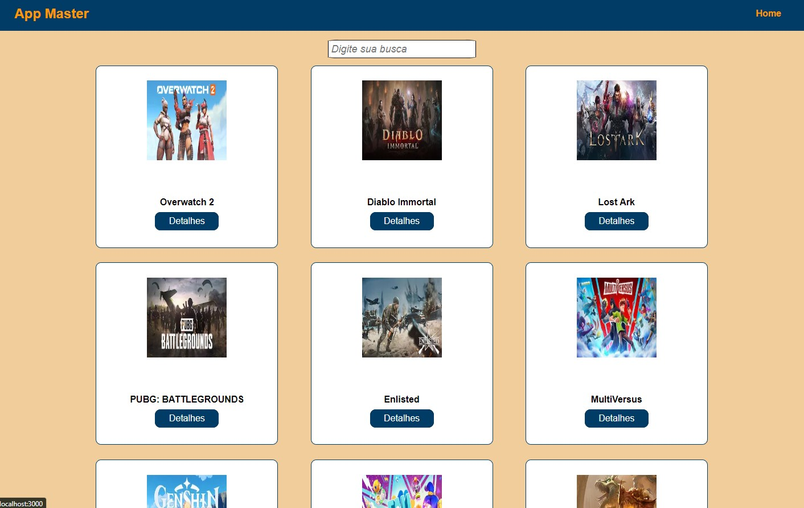
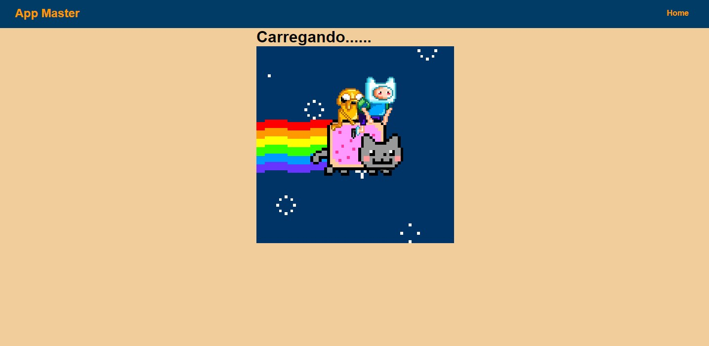
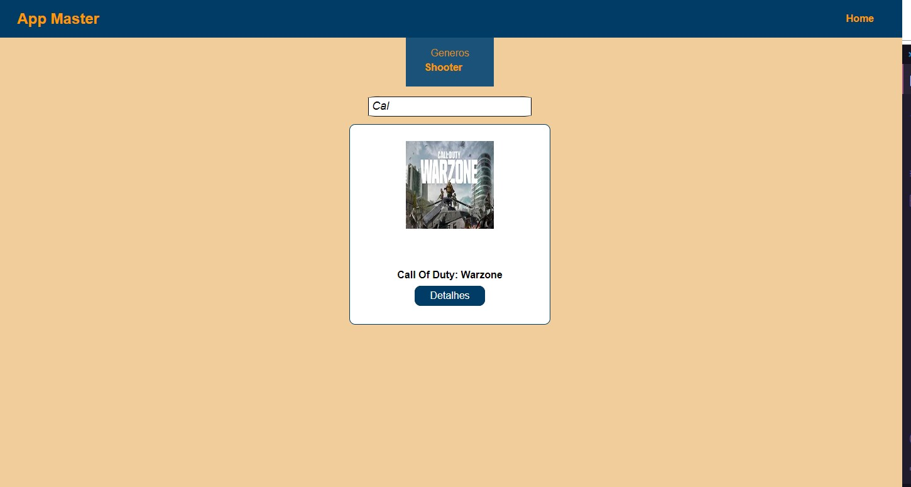
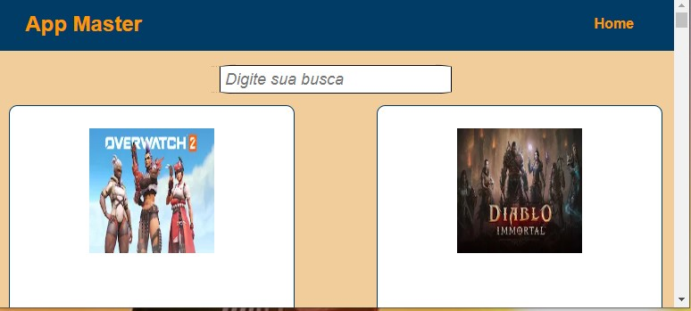
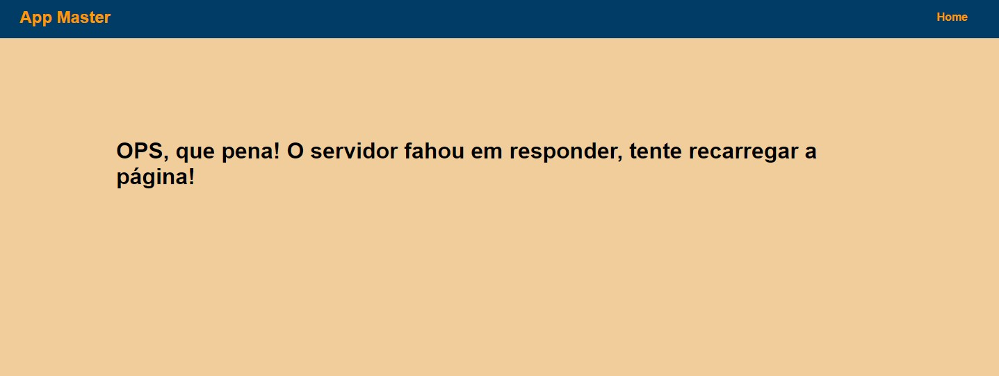

# Projeto de Estágio Frontend React

## Requisitos funcionais

A url base da API é [https://games-test-api-81e9fb0d564a.herokuapp.com/api/](https://games-test-api-81e9fb0d564a.herokuapp.com/api/data/)

- O projeto deve ser feito usando React ou Next.JS
- Obter a lista de jogos em `/data`
- Apresentar um loader enquanto os dados são obtidos
- Apresentar os jogos em três colunas (no computador)
- Em cada card apresentar o título e imagem pelo ao menos
- Lidar com a responsividade, para que fique bem apresentado no computador, tablets ou celular
- Quando a API retornar o `status code` 500, 502, 503, 504, 507, 508 ou 509 apresentar ao usuário `O servidor fahou em responder, tente recarregar a página`
- Caso a API retorne outros erros, apresentar `O servidor não conseguirá responder por agora, tente voltar novamente mais tarde`
- Ao realizar uma chamada, não esperar mais que 5 segundos pelo retorno. Se os dados demorarem mais de 5 segundos para retornar apresentar `O servidor demorou para responder, tente mais tarde`
- Sempre que apresentar uma mensagem para o usuário, ou tiver os dados em mãos para apresentar, ocultar o loader
- Incluir um campo de busca, que permite localizar jogos pelo título, com busca case insensitive
- Uma vez que tenha os dados em mãos, veja quais `genre` foram retornados e permita ao usuário selecionar um deles, e então filtre para exibir apenas jogos do gênero selecionado

> Na primeira foto temos a home page apresentando jogos em 3 colunas no computador como foi pedido, cada card contendo titulo e imagem! O botão detalhes não foi implementado.

> Na segunda foto temos o loader enquando carrega as informações.

> Na terceira foto temos o retorno de uma pesquisa case sensitive que abre opção para separar por generos de jogos.

> Na quarta foto está testando a responsividade para telas menores.

> Na ultima foto está o retorno quando a API retorna status 500-599

## Principais Tecnologias 

- NextJS
- CSS
- Git e Github